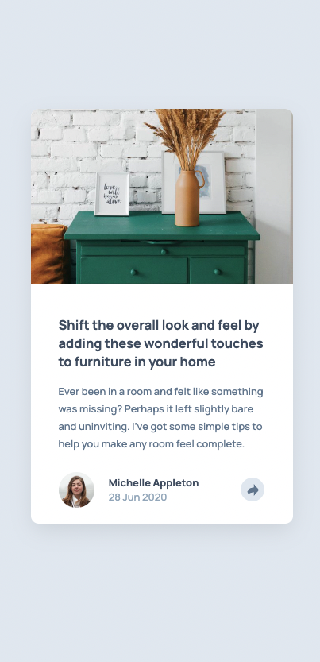
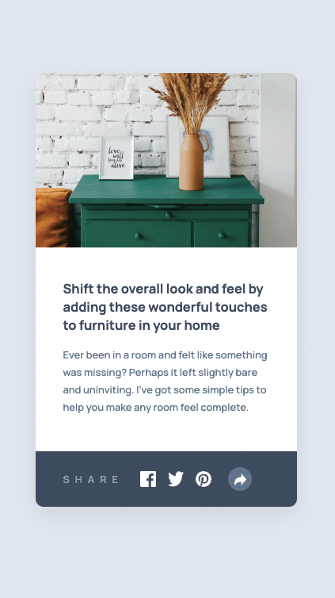
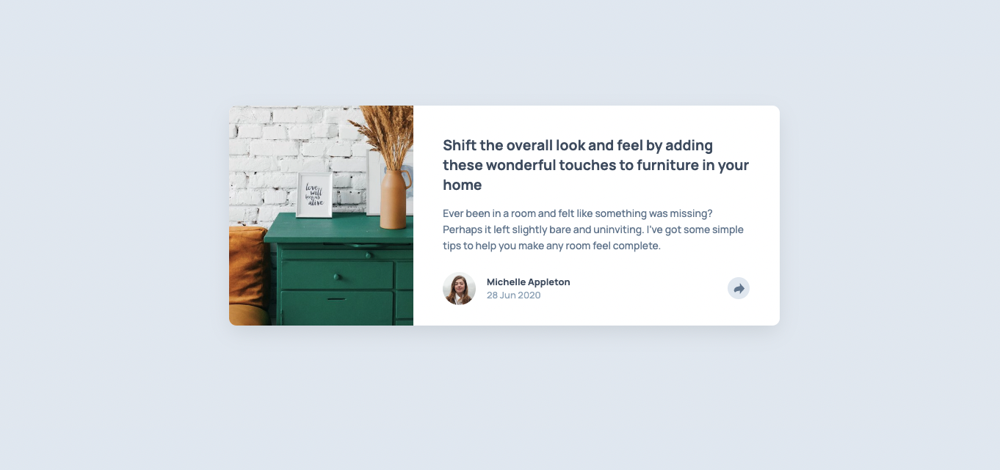
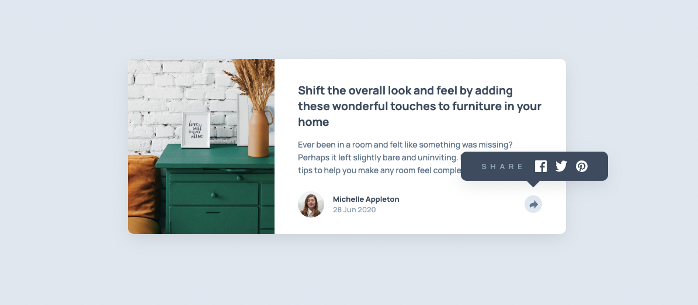

# Article preview card
Esta es una solución de [Article Preview Component challenge on Frontend Mentor](https://www.frontendmentor.io/challenges/article-preview-component-dYBN_pYFT). 

## Tabla de contenidos

- [Resumen](#resumen)
    - [Desafio](#desafio)
    - [Screenshots](#screenshots)
    - [Links](#links)
- [Proceso](#proceso)
    - [Hecho con](#hecho-con)
    - [Lo que aprendí](#lo-que-aprendí)

## Resumen

### Desafío

Los usuarios deben ser capaces de:

- Visualizar adecuadamente el diseño, tanto en móvil como en escritorio.
- Ver los elementos interactivos de la página.
- Ver/ocultar la sección de compartir.

### Screenshots

La vista móvil del componente queda de la siguiente manera:

Cuando el usuario toca el ícono de *compartir*, visualizará la sección que contiene las opciones para compartir. Si el usuario vuelve a tocar el mismo ícono, puede volver a la vista anterior.

Mientras que si el usuario usa una tableta o computadora, la vista se amplía:

En esta situación, cuando el usuario hace click sobre el ícono de *compartir*, podrá visualizar una pequeña ventana que contiene las opciones para compartir.

### Links

- Solución en Frontend Mentor: [Frontend Mentor](https://www.frontendmentor.io/solutions/article-preview-card-A6ovfT6csH)
- Live Site: [GitHub Pages](https://dgoperales.github.io/article-preview-card/)

## Proceso

### Hecho con

- HTML5
- CSS3
- JavaScript
- Flexbox
- Mobile First 

### Lo que aprendí

Con este desafío aprendí a manipular el DOM usando JavaScript. Empleando este lenguaje es posible mostrar/ocultar diferentes elementos HTML según la interacción que el usuario realice.

También aprendí a posicionar un elemento empleando la posición `absolute` que se acomoda fuera del flujo normal del documento para posicionarse según el diseño.

Finalmente, de una forma quizás más compleja, logré dar una solución al problema que se me planteaba durante el proceso; cerrar y abrir un elemento dependiendo del tamaño de pantalla. Empleando `matchMedia()` es posible realizar ciertos parámetros cuando se alcanza un ancho definido mediante una condicional `if...else`.

> No pares de aprender.